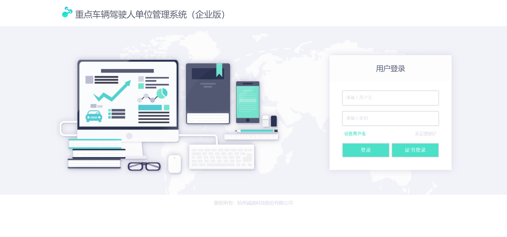

# Login Demo
This login demo was built during my internship at Trustway. It is based on a mockup that was given to me.

This application uses Ruby on Rails. It initially connected to the company's Oracle Database, but for the purpose of demonstration, it connects here to a PostgreSQL database, with mock usernames and passwords.

Live demo: https://tw-login-demo.herokuapp.com/
